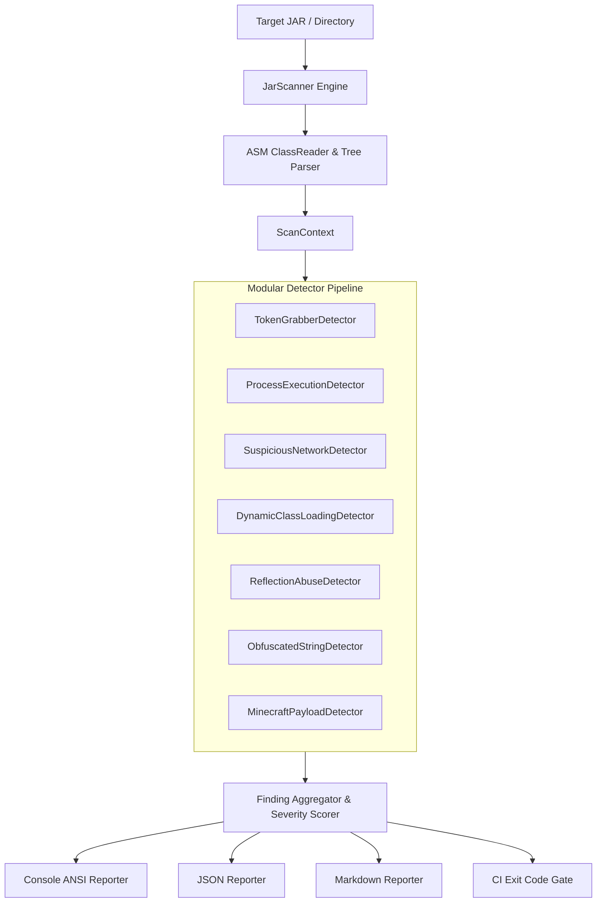

<div align="center">

```
  ██╗ █████╗ ██████╗ ███████╗███████╗███╗   ██╗████████╗██╗███╗   ██╗███████╗██╗     
  ██║██╔══██╗██╔══██╗██╔════╝██╔════╝████╗  ██║╚══██╔══╝██║████╗  ██║██╔════╝██║     
  ██║███████║██████╔╝███████╗█████╗  ██╔██╗ ██║   ██║   ██║██╔██╗ ██║█████╗  ██║     
  ██║██╔══██║██╔══██╗╚════██║██╔══╝  ██║╚██╗██║   ██║   ██║██║╚██╗██║██╔══╝  ██║     
█████║██║  ██║██║  ██║███████║███████╗██║ ╚████║   ██║   ██║██║ ╚████║███████╗███████╗
╚════╝╚═╝  ╚═╝╚═╝  ╚═╝╚══════╝╚══════╝╚═╝  ╚═══╝   ╚═╝   ╚═╝╚═╝  ╚═══╝╚══════╝╚══════╝
```

### **High-Performance Static Bytecode Malware & Threat Scanner for Java & JVM Ecosystems**

[](#)
[](#)
[](LICENSE)
[](CONTRIBUTING.md)
[](#)

[Features](#-key-features) • [Installation](#-installation--quick-start) • [Detection Matrix](#-threat-detection-matrix) • [CLI Manual](#-cli-usage) • [CI/CD Integration](#-github-actions--cicd-pipeline) • [Contributing](#-contributing)

---

</div>

## 📌 Overview

**JarSentinel** is an open-source static analysis engine designed to inspect Java `.jar` and `.class` archives for security threats, Remote Access Trojans (RATs), credential stealers, unauthorized process execution, dynamic bytecode injection, and obfuscated malicious payloads **without executing the target code**.

By operating directly on compiled bytecode via low-overhead **ASM Tree visitors**, JarSentinel scans thousands of classes in sub-second speeds, making it ideal for:
- 🛡️ **Minecraft Server Admins & Modpack Curators** auditing untrusted plugins and mods.
- 🏢 **DevOps & Security Engineers** gating build pipelines against poisoned third-party dependencies.
- 🔬 **Malware Analysts & Security Researchers** triaging unknown Java binaries.

---

## ✨ Key Features

- ⚡ **Blazing Fast Bytecode Analysis**: Processes hundreds of classes in milliseconds with zero reflection runtime overhead.
- 🎯 **Deep Threat Signatures**: Detects token grabbers, command droppers, hidden C2 webhooks, and reflection sandboxing escapes.
- 📊 **Multi-Format Reporting**: Generates interactive colored ANSI terminal summaries, structured JSON feeds, or GitHub-flavored Markdown tables.
- 🚦 **CI/CD Build Gating**: Configurable `--fail-on` exit codes (e.g. break build on `HIGH` or `CRITICAL` findings).
- 🧩 **Extensible Detector SPI**: Easily write and register custom threat detection rules.
- 📦 **Zero Heavy Dependencies**: Lightweight, standalone, single fat-JAR distribution.

---

## 🛡️ Threat Detection Matrix

| Detector | Category | Target Vectors & Signatures | Default Severity |
| :--- | :--- | :--- | :--- |
| **`token-grabber`** | `CREDENTIAL_STEALER` | Discord LevelDB paths, Chrome/Edge/Brave User Data, Telegram `tdata`, Crypto wallets, `.minecraft/launcher_profiles.json` | 🚨 `CRITICAL` |
| **`process-exec`** | `PROCESS_EXECUTION` | `Runtime.getRuntime().exec()`, `ProcessBuilder`, `powershell.exe`, `cmd.exe /c`, `certutil`, `curl`, `wscript` | 🚨 `CRITICAL` / ⚠️ `HIGH` |
| **`suspicious-network`** | `NETWORK_C2` | Hardcoded Discord Webhooks (`discord.com/api/webhooks/`), Telegram Bot API exfiltration, Pastebin/Rentry raw payload downloaders | 🚨 `CRITICAL` / ⚠️ `HIGH` |
| **`dynamic-injection`** | `DYNAMIC_INJECTION` | `ClassLoader.defineClass()`, `URLClassLoader` remote loading, `VirtualMachine.attach()` agent hot-plugging | ⚠️ `HIGH` / 🚨 `CRITICAL` |
| **`reflection-abuse`** | `REFLECTION_ABUSE` | `sun.misc.Unsafe` direct access, `setAccessible(true)` encapsulation bypass, private JDK internal access | 🟡 `MEDIUM` / ⚠️ `HIGH` |
| **`obfuscated-string`** | `OBFUSCATION_MALICIOUS` | Bytecode XOR decryption loops (`IXOR` inside array assignment loops), hidden C2 string concealers | 🟡 `MEDIUM` |
| **`minecraft-payload`** | `CREDENTIAL_STEALER` | Fractureiser worm signatures, session authentication token extractors (`getAuthenticatedToken`) | 🚨 `CRITICAL` |

---

## 🚀 Installation & Quick Start

### Option 1: Download Standalone JAR
Download the latest `jarsentinel.jar` from the [Releases](https://github.com/picun974/jarsentinel/releases) page.

```bash
# Scan a single plugin or mod
java -jar jarsentinel.jar untrusted-mod.jar

# Scan an entire directory of plugins recursively
java -jar jarsentinel.jar -p ./plugins/
```

### Option 2: Build from Source
```bash
git clone https://github.com/picun974/jarsentinel.git
cd jarsentinel

# Build with Maven
mvn clean package

# Run the compiled fat JAR
java -jar target/jarsentinel.jar --help
```

---

## 💻 CLI Usage

```text
USAGE:
  java -jar jarsentinel.jar [OPTIONS] <path-to-jar-or-dir>

OPTIONS:
  -p, --path <path>          Path to target .jar file or directory
  -s, --severity <level>     Minimum severity to report: INFO, LOW, MEDIUM, HIGH, CRITICAL (default: LOW)
  -f, --format <format>      Output format: CONSOLE, JSON, MARKDOWN (default: CONSOLE)
  -o, --output <file>        Save report to designated output file
  --fail-on <level>          Exit with code 2 if threats equal or exceed this level (default: HIGH)
  --disable <detector-id>    Disable specific detector (e.g. --disable token-grabber)
  --no-color                 Disable ANSI terminal color output
  -v, --version              Print JarSentinel version
  -h, --help                 Show this help manual
```

### Common Examples

#### 1. Generate Markdown Security Audit Report for CI
```bash
java -jar jarsentinel.jar -p ./build/libs/ -f MARKDOWN -o audit-report.md
```

#### 2. Gate CI Pipeline (Break on Critical Threats)
```bash
java -jar jarsentinel.jar ./target/application.jar --fail-on CRITICAL
```

#### 3. Export Findings to JSON for SIEM / Security Pipeline
```bash
java -jar jarsentinel.jar -p ./mods/ -f JSON -o results.json
```

---

## 🏗️ Architecture



---

## 🤖 GitHub Actions & CI/CD Pipeline

Easily add JarSentinel to your repository to scan all compiled JARs automatically on pull requests:

```yaml
name: Security Audit

on: [push, pull_request]

jobs:
  bytecode-scan:
    runs-on: ubuntu-latest
    steps:
      - uses: actions/checkout@v4
      
      - name: Set up JDK 17
        uses: actions/setup-java@v4
        with:
          java-version: '17'
          distribution: 'temurin'
          
      - name: Build Project
        run: ./gradlew build # or mvn package
        
      - name: Run JarSentinel
        run: |
          curl -sLO https://github.com/jarsentinel/jarsentinel/releases/latest/download/jarsentinel.jar
          java -jar jarsentinel.jar -p ./build/libs/ --fail-on HIGH -f MARKDOWN -o security-report.md
          
      - name: Archive Security Report
        if: always()
        uses: actions/upload-artifact@v4
        with:
          name: security-report
          path: security-report.md
```

---

## 🧩 Developing Custom Detectors

JarSentinel is designed for extension. You can implement your own detector in 10 lines of code:

```java
public class MyCustomDetector implements Detector {
    @Override
    public String getId() { return "my-custom-rule"; }

    @Override
    public String getName() { return "Custom Rule"; }

    @Override
    public String getDescription() { return "Detects custom pattern"; }

    @Override
    public ThreatCategory getCategory() { return ThreatCategory.GENERAL_SUSPICIOUS; }

    @Override
    public void scanClass(ClassNode classNode, ScanContext context) {
        // Inspect classNode instructions, constants, or methods using ASM Tree API
    }
}
```

---

## 🤝 Contributing

Contributions are welcome! Please read [CONTRIBUTING.md](CONTRIBUTING.md) for details on our code of conduct and the process for submitting pull requests.

---

## 📄 License

This project is licensed under the **Apache License 2.0** - see the [LICENSE](LICENSE) file for details.
